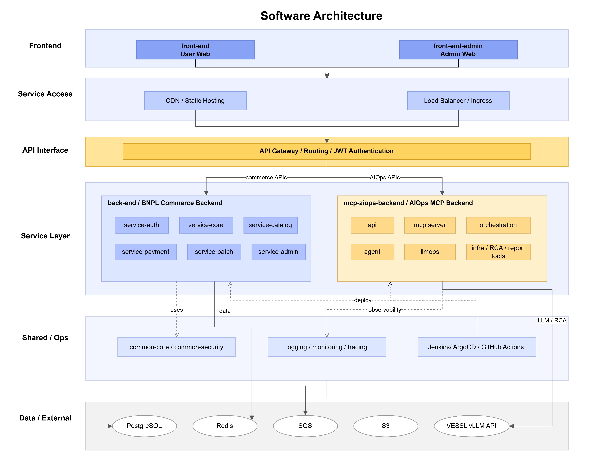
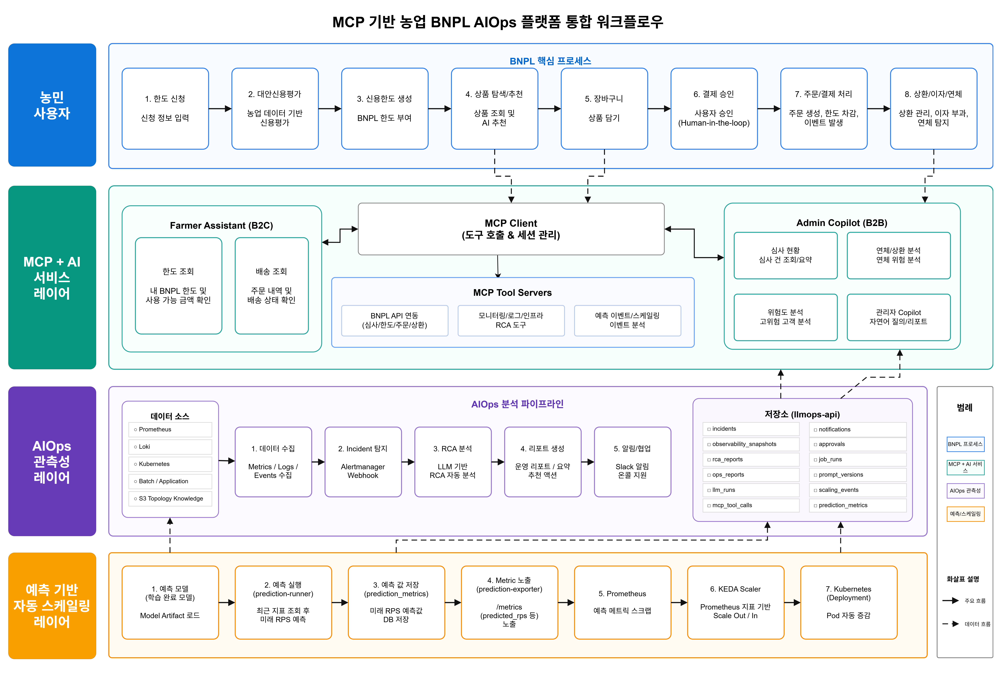

# [우리FISA 6기] 클라우드 엔지니어링 과정 3팀

## 1. 프로젝트 개요

* **주제** : 농업 데이터 기반 BNPL 플랫폼 - 시계열 예측 기반 Kubernetes 오토스케일링 및 Observability 통합 시스템 구축

* **프로젝트 기획 배경** :

  농업인은 영농 주기(파종·생육·수확)에 따라 소득 시점이 달라, 비용은 영농 초기에 먼저 나가지만 수익은 수확 이후 발생하는 **현금흐름 불일치**를 겪습니다. 하지만 기존 금융권은 급여·금융거래 이력 중심으로 평가해 이런 계절성 소득 구조를 반영하기 어렵습니다.

  또한 파종기·수확기·상환일에는 신청·결제·상환 요청이 한 시점에 몰려 **트래픽이 급증**합니다. Reactive 오토스케일링은 트래픽이 늘어난 뒤 Pod를 추가하므로, HPA가 반응하기 전 구간에서 지연·장애가 발생할 수 있습니다.

  이에 본 프로젝트는 두 가지를 함께 해결합니다.

  * **농업 데이터 기반 대안신용평가 BNPL 서비스** — 농지·작물·보험·상환 이력으로 농업인 맞춤 한도 산정
  * **Predictive 오토스케일링** — 트래픽을 사전 예측해 Pod를 미리 확보하고, Reactive 방식과 비교 검증

  즉, 단순 서비스 배포가 아니라 **하이브리드 클라우드 환경에서의 예측 기반 운영 구조 검증**이 본 프로젝트의 핵심입니다.

* **기술 스택** :

  | 영역 | 기술 스택 |
  | --- | --- |
  | Frontend |      |
  | Backend |        |
  | Test |     |
  | Data / Event |    |
  | AI / AIOps |       |
  | Infrastructure |       |
  | DevOps |        |
  | Observability |          |

---

## 2. 아키텍쳐

### 2-1. 시스템 아키텍쳐


### 설명

AWS · On-Prem · VESSL AI를 Site-to-Site VPN으로 연결한 하이브리드 클라우드 구조입니다.

**AWS — 사용자 접점 · 채널계 · DR**

* **엣지/보안** : Route 53 → WAF(Shield·ACM) → CloudFront (정적은 S3, 동적은 ALB → EKS)
* **컴퓨트** : EKS를 두 AZ(A/B) private subnet에 배치, Auto Scaling 운영 / public subnet에 Bastion·NAT Gateway
* **데이터/DR** : RDS AZ 간 복제 + DR Standby(KMS 암호화), DB 자격증명은 Secrets Manager
* **부가** : ECR(이미지)·SQS(메시징), 운영 알림은 CloudWatch → Lambda → SNS

**On-Prem — 핵심 금융 서비스 · 데이터 · 운영** (192.168.0.0/24·10.30.0.0/16)

* **경계** : VPN Gateway 뒤 pfSense Active/Standby로 이중화
* **K8s 네임스페이스** : Service(백엔드·Cronjob) / Observability(Prometheus·kube-state-metrics·AlertManager·OTel) / AiOps(KEDA·MCP·예측 모델) / CI/CD(ArgoCD GitOps · Harbor·Trivy)
* **DaemonSet** : Fluent-bit·Cilium Agent·Node-exporter
* **데이터** : PostgreSQL Patroni Write/Read 이중화, TrueNAS PV 스토리지, GitLab·Jenkins 소스·빌드

**VESSL AI (kr-west)** — vLLM 기반 Qwen3-32B를 서빙해 AIOps의 LLM 추론 담당

**하이브리드 연계**

* AWS VPN Gateway ↔ On-Prem pfSense Site-to-Site VPN
* On-Prem PostgreSQL(Read) → AWS DMS Full-load + CDC → DR RDS
* 예측값(PostgreSQL) → prediction-exporter → Prometheus → KEDA 예측형 오토스케일링

---

### 2-2. 소프트웨어 아키텍처



### 설명

* **계층 분리** : 프론트엔드 · API · 백엔드 · 데이터 · AI/오토스케일링 · Observability 로 분리. 백엔드는 인증·신용·상품/결제·관리·배치로 책임을 나눔.
* **폴리글랏** : 금융 도메인은 Spring Boot(Java), AIOps·예측 모델은 FastAPI/FastMCP(Python).
* **데이터** : 핵심 금융 데이터·예측 메트릭은 PostgreSQL, 세션·임시 저장·캐시는 Redis.
* **이벤트/배치** : 결제는 SQS 이벤트로 비동기 처리(이벤트 ID 기준 멱등), 배치가 이자·자동 상환·연체를 담당.
* **예측 스케일링** : 예측값(PostgreSQL) → prediction-exporter → Prometheus → KEDA Scale-out.
* **공통 관심사** : Spring Security·JWT 인증/인가, 검증·예외 처리, OpenTelemetry 분산 트레이싱.
* **관측/운영** : Prometheus·Loki·Tempo·Alertmanager·Grafana 통합 관측, MCP 기반 AIOps가 장애 원인 후보(RCA)·운영 리포트 생성.

---

## 3. 주요 기능 소개

### 3-1. 핵심 기술 구성

| 핵심 기술 | 설명 |
| --- | --- |
| 하이브리드 클라우드 MSA | AWS 채널계(`service-catalog`)와 On-Prem 핵심계(인증·신용·결제) 마이크로서비스를 Site-to-Site VPN으로 연결하고, 금융 데이터 민감도를 기준으로 서비스를 분산 배치. |
| 고가용성 & 재해복구(DR) | VLAN 망분리와 pfSense Active/Standby(CARP)로 네트워크 경계·이중화를 구성하고, PostgreSQL Patroni HA에 더해 AWS DMS CDC로 On-Prem DB를 RDS에 실시간 복제해 DR 환경을 구성. |
| 예측형 오토스케일링 | Reactive 방식의 반응 지연을 보완하기 위해, 예측 모델이 미래 트래픽을 PostgreSQL에 저장하면 prediction-exporter → Prometheus를 거쳐 KEDA가 External Metric으로 읽어 Pod를 사전 Scale-out. |
| 통합 Observability | 하이브리드(AWS·On-Prem)의 메트릭·로그·트레이스·알림을 통합 수집. Cilium(eBPF) CNI로 별도 계측 없이 HTTP 요청량·응답시간을 관측. |
| FastMCP 기반 AIOps | 메트릭·로그·알림·Kubernetes 조회 등 운영 도구를 MCP Tool로 표준화하고, 장애 발생 시 LLM 기반으로 원인 후보(RCA)와 운영 리포트를 자동 생성. |

---

### 3-2. 통합 워크플로우 다이어그램


---

### 3-3. 세부 기능 소개

#### [이벤트 기반 BNPL 결제]
 
* 기능 설명 :
  체크아웃 시 결제 요청을 저장한 뒤 SQS로 결제 이벤트를 발행하고, 결제 서비스가 이를 소비해 한도 차감·주문 생성·이용 원장 기록을 수행합니다. SQS는 at-least-once 전달이므로, 처리 이력 테이블(paymentEventProcessLog)에 이벤트 ID와 결제 요청 Public ID를 기록해 동일 결제의 중복 반영을 방지합니다(애플리케이션 레벨 멱등 처리).
  또한 SQS 메시지 attribute에 OpenTelemetry trace context를 함께 전달하고, 결제 서비스 소비 시 이를 복원해 체크아웃 → SQS → 결제 소비로 이어지는 결제 흐름을 end-to-end 추적할 수 있도록 구성했습니다.
  
* 핵심 코드(스크립트) :
```java
// 결제 요청 저장 후 SQS 이벤트 발행
BnplPaymentRequest paymentRequest = bnplPaymentRequestRepository.saveAndFlush(BnplPaymentRequest.create(
        paymentRequestPublicId,
        userPublicId,
        totalAmount,
        cartItems
));

UUID orderPublicId = orderPublicId(paymentRequest.getPublicId());

creditPaymentEventProducer.publish(
        toEvent(paymentRequest, orderPublicId, cartItems, request.deliveryAddress(), request.idempotencyKey())
);
```
 
```java
// SQS 메시지 발행 및 trace context 전파
SendMessageRequest request = SendMessageRequest.builder()
        .queueUrl(paymentRequestQueueUrl)
        .messageBody(payload)
        .messageGroupId(event.userPublicId().toString())
        .messageDeduplicationId(event.paymentRequestPublicId().toString())
        .messageAttributes(SqsTraceContext.currentMessageAttributes())
        .build();
```

```java
// 이벤트 소비 시 멱등 처리 + 주문 생성 + 한도 차감 + 이용 원장 기록
if (paymentEventProcessLogRepository.existsByEventIdOrPaymentRequestPublicId(eventId, paymentRequestPublicId)) {
    return;
}

order = orderRepository.save(Order.confirmed(
        orderPublicId,
        userPublicId,
        paymentRequestPublicId,
        message.totalAmount(),
        message.deliveryAddress(),
        message.items(),
        Objects.requireNonNullElse(message.occurredAt(), LocalDateTime.now())
));

creditLimit.use(message.totalAmount());

creditUsageLedgerRepository.save(CreditUsageLedger.purchase(
        creditLimit.getPublicId(),
        order.getPublicId(),
        paymentRequestPublicId,
        message.totalAmount(),
        usedAt
));

paymentEventProcessLogRepository.save(PaymentEventProcessLog.processed(
        eventId,
        paymentRequestPublicId,
        message.idempotencyKey()
));
```

* 코드 링크(스크립트 링크) :
  * `back-end/service-catalog/src/main/java/com/kkpp/catalog/checkout/service/CheckoutService.java`
  * `back-end/service-catalog/src/main/java/com/kkpp/catalog/checkout/event/SqsCreditPaymentEventProducer.java`
  * `back-end/service-payment/src/main/java/com/kkpp/payment/event/SqsCreditPaymentRequestedConsumer.java`
  * `back-end/service-payment/src/main/java/com/kkpp/payment/service/CreditPaymentProcessingService.java`
  * `back-end/service-payment/src/main/java/com/kkpp/payment/domain/PaymentEventProcessLog.java`
---
 
#### [예측형 오토스케일링]
 
* 기능 설명 :
  GRU 예측 모델이 서비스별 미래 요청량을 산출하고, 우선순위 기반 정책으로 필요 Pod 수를 계산해 PostgreSQL ai.prediction_metrics에 저장합니다. KEDA external scaler(GRU)가 이 예측을 트리거로 service-payment·service-core·service-admin Deployment를 사전 Scale-out하며(kkpp 네임스페이스에서 라이브 운영 중), prediction-exporter는 동일 예측값을 Prometheus 메트릭(aiops_predicted_pods 등)으로 노출해 관측합니다.
  또한 격리 네임스페이스(kkpp-exp-reactive/kkpp-exp-predictive)와 오프라인 시뮬레이션으로 Reactive(현재 RPS 기반 KEDA Prometheus scaler) vs Predictive(GRU external scaler) 를 동일 이미지·리소스·replica cap·부하 조건에서 비교 검증했습니다. (모델은 Prophet·SARIMA·GRU·LSTM 중 Under-provisioning rate 기준으로 GRU 선정)

  **HPA vs KEDA 비교 결과** (동일 부하 조건)
  | 지표 | HPA (Reactive) | KEDA + GRU (Predictive) | 비교 |
  | --- | --- | --- | --- |
  | 최고 RPS | 112 req/s | 91.4 req/s | 약 18.4% 감소 |
  | P95 최고 지연시간 | 9.70s | 389ms | 96.0% 감소 |
  | P99 최고 지연시간 | 9.94s | 1.55s | 84.4% 감소 |
  | 500 에러 발생률 | 순간 100% | 0% | 100%p 감소 |

  → 예측 기반(KEDA+GRU) 스케일링이 트래픽 급증 구간의 지연과 오류를 대폭 줄여, 서비스 안정성을 확보했습니다.

  
* 핵심 코드(스크립트) :

```python
# prediction-exporter: ai.prediction_metrics 최신 예측값을 Prometheus 메트릭으로 노출
statement = text(
    """
    with ranked as (
        select namespace, service_name, metric_name, predicted_value, target_time,
               row_number() over (
                   partition by namespace, service_name, metric_name
                   order by target_time desc, created_at desc, id desc
               ) as rn
        from ai.prediction_metrics
        where namespace = :namespace and service_name = any(:services)
    )
    select service_name, metric_name, predicted_value
    from ranked where rn = 1
    """
)
# -> aiops_predicted_pods{service="payment",...} 형태로 /metrics 노출
```
 
```python
# 한정된 Pod 예산을 서비스 우선순위(payment>auth>...)로 배분
allocated = min_pods.copy()
remaining = pod_budget - min_total
weighted = {svc: extra_demand[svc] / policies[svc].priority for svc in desired}
weighted_total = sum(weighted.values())
for svc, raw_share in raw_shares.items():
    grant = min(int(np.floor(raw_share)), extra_demand[svc])
    allocated[svc] += grant
    remaining -= grant
```
 
```bash
# 라이브 KEDA ScaledObject (external trigger = GRU scaler)
$ kubectl get scaledobject -n kkpp
NAME                  SCALETARGETNAME   MIN  MAX  READY  ACTIVE  TRIGGERS   AGE
service-payment-gru   service-payment   1    8    True   True    external   8d
service-core-gru      service-core      1    6    True   True    external   44h
service-admin-gru     service-admin     1    3    True   True    external   8d
```
 
* 코드 링크(스크립트 링크) :
  * `ai-prediction-model/src/exporters/prediction_metrics_exporter.py`
  * `ai-prediction-model/src/evaluation/service_pod_policy.py`
  * `ai-prediction-model/src/evaluation/pod_policy.py`
  * `autoscaling-experiment/` (Reactive vs Predictive 비교 실험)
  * `autoscaling-experiment/18-offline-scaling-sim.py`
---
 
#### [FastMCP 기반 AIOps Agent]
 
* 기능 설명 :
  FastAPI/FastMCP 기반 MCP 서버로 Prometheus·Loki·Alertmanager·Kubernetes 조회 도구를 표준화했습니다. Alertmanager 알림 발생 시 관련 메트릭·로그를 모아 장애 원인 후보(RCA)와 운영 리포트 초안을 생성하며, LLM 추론은 VESSL AI의 vLLM(Qwen3-32B)을 사용합니다.
* 핵심 코드(스크립트) :
```python
for tool_plan in plan_result.planned_tools:
    if not is_read_tool_plan(tool_plan):
        continue

    enriched_plan = inject_alertmanager_execution_context(
        tool_plan,
        incident_key=plan_result.incident_key,
        incident_window=incident_window,
    )
    tool_results.append(self._dispatcher.execute(enriched_plan))
```


```python
tool = resolve_registered_tool(
    server_name=plan.server_name,
    tool_name=plan.tool_name,
)
policy = resolve_tool_policy(McpToolPermission(tool.tool_permission))

if policy.execution_policy != McpExecutionPolicy.ALLOWED:
    return build_tool_result(
        tool=tool,
        call_status=policy.call_status,
        response_payload={"message": "Tool execution requires confirmation or approval."},
    )
```


* 코드 링크(스크립트 링크) :
    * `mcp-aiops-backend/src/aiops_platform/main.py`
    * `mcp-aiops-backend/src/aiops_platform/mcp/server.py`
    * `mcp-aiops-backend/src/aiops_platform/mcp/policy.py`
    * `mcp-aiops-backend/src/aiops_platform/mcp/schemas.py`
    * `mcp-aiops-backend/src/aiops_platform/agent/dispatcher.py`
    * `mcp-aiops-backend/src/aiops_platform/alertmanager_agent/service.py`
---
 
#### [CQRS 기반 읽기/쓰기 분리 (성능 개선)]
 
* 기능 설명 :
  데이터 변경(쓰기)과 조회(읽기)의 모델·책임을 분리하는 CQRS 패턴을 적용하고, DB도 PostgreSQL Primary(쓰기)/Replica(읽기)로 분리해 조회 부하를 Replica로 분산했습니다. K6 부하 테스트(100 RPS, 10분) 결과, 응답 시간과 요청 처리 안정성이 모두 개선됐습니다.
  | 지표 | 적용 전 | 적용 후 | 차이 |
  | --- | --- | --- | --- |
  | 평균 응답 시간 | 50.48ms | 35.60ms | 29.5% 감소 |
  | p95 응답 시간 | 68.05ms | 51.28ms | 24.6% 감소 |
  | 최대 응답 시간 | 4.01s | 1.38s | 65.6% 감소 |
  | 실패율 | 0% | 0% | - |
  | Dropped Iterations | 304건 | 21건 | 93.1% 감소 |
* 핵심 코드(스크립트) :
```java
// core DB용 Repository / EntityManager / TransactionManager 분리
@EnableJpaRepositories(
    basePackages = {
        "com.kkpp.admin.adminauth.repository",
        "com.kkpp.admin.bnpl.repository",
        "com.kkpp.admin.order.repository",
        "com.kkpp.admin.credit.repository"
    },
    entityManagerFactoryRef = "coreEntityManagerFactory",
    transactionManagerRef = "coreTransactionManager"
)
```
```java
// 조회 모델: readOnly 트랜잭션 + DTO Projection 조회
@Transactional(readOnly = true)
public CreditReviewPageResponse getReviews(CreditReviewStatus status, int page, int size) {
    Page<CreditReviewSummaryResponse> result =
            applicationRepository.findReviewSummaries(status, pageable);

    return new CreditReviewPageResponse(
            result.getContent(),
            result.getNumber(),
            result.getSize(),
            result.getTotalElements(),
            result.getTotalPages(),
            result.isFirst(),
            result.isLast()
    );
}
```
```java
// 쓰기 모델: 별도 쓰기 트랜잭션 + 비관적 락
@Transactional
public CreditReviewDecisionResponse approve(UUID publicId, ApproveCreditReviewRequest request) {
    CreditReviewApplication application = getApplicationForUpdate(publicId);

    application.approve(request.reviewedBy(), request.approvedAmount(), decidedAt);

    CreditReviewLimit savedLimit = limitRepository.save(limit);
}

@Lock(LockModeType.PESSIMISTIC_WRITE)
@Query("select application from CreditReviewApplication application join fetch application.user where application.publicId = :publicId")
Optional<CreditReviewApplication> findByPublicIdForUpdate(@Param("publicId") UUID publicId);
```
 
* 코드 링크(스크립트 링크) :
  * `back-end/service-admin/src/main/java/com/kkpp/admin/global/config/CoreDataSourceConfig.java`
  * `back-end/service-admin/src/main/java/com/kkpp/admin/global/config/CatalogDataSourceConfig.java`
  * `back-end/service-admin/src/main/java/com/kkpp/admin/credit/service/CreditReviewService.java`
  * `back-end/service-admin/src/main/java/com/kkpp/admin/credit/repository/CreditReviewApplicationRepository.java`
  * `back-end/service-admin/src/main/java/com/kkpp/admin/bnpl/service/BnplAdminService.java`
---
 
#### [CI/CD 빌드 최적화 (성능 개선)]
 
* 기능 설명 :
  이미지 최적화와 빌드 파이프라인 최적화를 함께 수행했습니다. 멀티스테이지 빌드와 경량 런타임 베이스를 적용하고 취약 베이스·불필요 패키지를 제거해 이미지 크기와 보안 취약점을 줄였습니다(Trivy 스캔 기준 취약점 0). 멀티스테이지로 늘어난 빌드 시간은, Docker 내부의 중복 Gradle 빌드를 제거(Jenkins가 생성한 JAR만 패키징)하고 Spring Boot Layered JAR로 의존성 레이어를 Harbor에 캐싱하여 단축했습니다.
  | 이미지 | 적용 전 | 적용 후 | 비교 |
  | --- | --- | --- | --- |
  | 이미지 크기 | 842MB | 694MB | 17.5% 감소 |
  | 취약점 개수 | 128 | 0 | 100% 감소 |
  | 레이어 개수 | 48 | 32 | 33.3% 감소 |
  | 파이프라인 | 적용 전 | 적용 후 | 비교 |
  | --- | --- | --- | --- |
  | Docker Build & Push | 2분 5초 | 45초 | 약 64% 단축 |
  | 전체 파이프라인 | 5분 27초 | 3분 10초 | 약 42% 단축 |
* 핵심 코드(스크립트) :
```dockerfile
FROM python:3.11-slim-bookworm AS builder

ENV PYTHONDONTWRITEBYTECODE=1 \
    PYTHONUNBUFFERED=1 \
    PIP_NO_CACHE_DIR=1 \
    PIP_DISABLE_PIP_VERSION_CHECK=1

WORKDIR /app

COPY pyproject.toml README.md ./
COPY src ./src

RUN python -m pip install --upgrade pip \
    && python -m pip install --no-compile --target=/app/site-packages .

FROM gcr.io/distroless/python3-debian12:nonroot AS runtime

ENV PYTHONDONTWRITEBYTECODE=1 \
    PYTHONUNBUFFERED=1 \
    PYTHONPATH="/app/site-packages"

WORKDIR /app

COPY --from=builder --chown=nonroot:nonroot /app/site-packages /app/site-packages

EXPOSE 8000

CMD ["-m", "uvicorn", "aiops_platform.main:app", "--host", "0.0.0.0", "--port", "8000"]
```
 
* 코드 링크(스크립트 링크) :
  * `TODO: Dockerfile 경로`
  * `TODO: Jenkinsfile 경로`